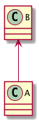
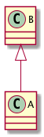
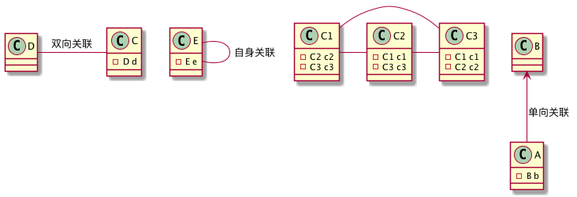
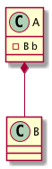
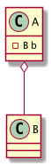
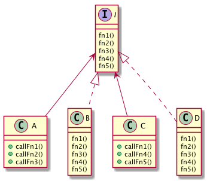
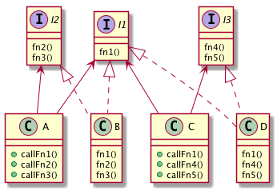

# 设计模式学习

## UML类图基础知识复习
### 为何要在此介绍UML
  通过UML来讲解或描述各种设计模式相比代码更加直观，更加易于理解
### 类与类之间的关系
#### 类与类之间产生关系，是通过这几种方式呈现的：  
  - A类继承了B类
  - A类实现了B接口或B抽象类
  - A类的对象作为B类的成员变量
  - B类作为A类的成员方法的返回值类型
  - B类的对象作为A类的成员方法的参数
  - B类的对象作为局部变量出现在A类的成员方法内。
#### 按关系紧密程度的不同又可分为下面六类关系：
1. 依赖 Dependency
   > A类中引到了B类。可能是继承B类、实现了B接口/抽象类，B类的对象作为A类的成员变量、返回值、方法参数、或局部变量。
   
   

2. 泛化（继承）Generalization
   > A类继承了B类。是依赖系统的一种特例。

   

3. 实现 Implementation
   > A类实现了B接口或B抽象类。是依赖系统的一种特例。
  
   

4. 关联 Association
   > 表示B类的对象作为A类的成员变量。是依赖系统的一种特例。具有导向性可以单向关联、双向关联、自身关联、多维关联等。
   
   

   ```php
   class A{
       private $b; //B类的实例
   }
   class B {

   }
   ```

5. 聚合 Aggregation
   > B类的对象是A类的组成部分，A与B是整体与部分的关系，不能分开。A被实例化时A中的b也自动被实例化，同生共死的关系。

   

   ```php
   class A{
       private $b ; //B类的实例
       function __construct(){
           $this->b = new B();
       }
   }
   class B {

   }
   ```

6. 组合 Composition
   > A与B也是整体与部分的关系，但整体与部分可以分开。

   

   ```php
   class A{
       private $b ; //B类的实例
       function setB(B $b){
           $this->b = $b;
       }
   }
   class B {

   }
   ```

## 使用设计模式的目的、原则
### 目的
  使代码更高内聚、低耦合、易维护、扩展性更强、重用性更好、更灵活。
### 原则
  1. 单一职责原则
  
    降低类的复杂度，代码更可读，更易维护和扩展，大大降低变更风险。
    一般都要遵照此原则进行设计，除非类内方法极少，逻辑简单。

    ```PHP

    // 对比以下各段代码:

    // ================== 代码1： ================== 
    // 问题：所有需求在都由同一类去实现，出现不合逻辑的错误。
    class Animal{
        function move( $name ){
            echo "{$name} 在地上跑。。";
        }
    }
    $a = new Animal();
    $a->move("Tiger"); 
    $a->move("Horse");
    $a->move("Fish"); // 不合理
    $a->move("Bird"); // 不合理
    
     // ================== 代码2： ================== 
    // 问题：同代码1一样。甚至更恶心。
    class Animal{
        function move( $name ){
            if( "Tiger" == $name || "Horse" == $name ){
                echo "{$name} 在地上跑。。";
            }elseif( "Fish" == $name ){
                echo "{$name} 在水里游。。";
            }elseif( "Bird" == $name ){
                echo "{$name} 在天上飞。。";
            }
        }
    }
    $a = new Animal();
    $a->move("Tiger"); 
    $a->move("Horse");
    $a->move("Fish");
    $a->move("Bird");

    // ================== 代码3： ================== 
    // 问题： 在类内分开不同的方法，至少方法单一职责了。但对调用方仍然复杂
    class Animal{
        function run( $name ){
            echo "{$name} 在地上跑。。";
        }
        function swim( $name ){
            echo "{$name} 在水里游。。";
        }
        function fly( $name ){
            echo "{$name} 在天上飞。。";
        }
    }
    $a = new Animal();
    $a->run("Tiger"); 
    $a->swim("Fish");
    $a->fly("Bird");


    // ================== 代码4： ================== 
    // 问题：类级别上做了分离，但同上，仍对调用方不友好。
    class LandAnimal{
        function move( $name ){
            echo "{$name} 在地上跑。。";
        }
    }
    class WaterAnimal{
        function move( $name ){
            echo "{$name} 在水里游。。";
        }
    }
    class SkyAnimal{
        function move( $name ){
            echo "{$name} 在天上飞。。";
        }
    }
    $a = new LandAnimal();
    $b = new WaterAnimal()
    $c = new SkyAnimal();
    $a->move("Tiger"); 
    $b->move("Fish");
    $c->move("Bird");

    ```

  2. 接口隔离原则
    
    客户端不应依赖它不需要的接口，即一个类对另一个类的依赖应该建立在最小化的接口上

    ```php
    // ================== 代码1： ================== 
    interface I{
        function fn1();
        function fn2();
        function fn3();
        function fn4();
        function fn5();
    }
    class A {
        function callFn1( I $i ){
            $i.fn1();
        }
        function callFn2( I $i ){
            $i.fn2();
        }
        function callFn3( I $i ){
            $i.fn3();
        }
    }
    class B implements I {
        function fn1(){ echo "B fn1()"; }
        function fn2(){ echo "B fn2()"; }
        function fn3(){ echo "B fn3()"; }
        function fn4(){ } // 没用，但还是得实现
        function fn5(){ } // 没用，但还是得实现
    }
    class C {
        function callFn1( I $i ){
            $i.fn1();
        }
        function callFn4( I $i ){
            $i.fn4();
        }
        function callFn5( I $i ){
            $i.fn5();
        }
    }
    class D implements I {
        function fn1(){ echo "D fn1()"; }
        function fn2(){ } // 没用，但还是得实现
        function fn3(){ } // 没用，但还是得实现
        function fn4(){ echo "D fn4()"; }
        function fn5(){ echo "D fn5()"; }
    }
    $a = new A();
    $a->callFn1( new B() );
    $a->callFn2( new B() );
    $c = new C();
    $c->callFn1( new D() );
    $c->callFn2( new D() );

    // ================== 代码2： ================== 
    interface I1{
        function fn1();
    }
    interface I2{
        function fn2();
        function fn3();
    }
    interface I3{
        function fn4();
        function fn5();
    }
    class A {
        function callFn1( I1 $i ){
            $i.fn1();
        }
        function callFn2( I2 $i ){
            $i.fn2();
        }
        function callFn3( I2 $i ){
            $i.fn3();
        }
    }
    class B implements I1,I2 {
        function fn1(){ echo "B fn1()"; }
        function fn2(){ echo "B fn2()"; }
        function fn3(){ echo "B fn3()"; }
    }
    class C {
        function callFn1( I1 $i ){
            $i.fn1();
        }
        function callFn4( I3 $i ){
            $i.fn4();
        }
        function callFn5( I3 $i ){
            $i.fn5();
        }
    }
    class D implements I1, I3 {
        function fn1(){ echo "D fn1()"; }
        function fn4(){ echo "D fn4()"; }
        function fn5(){ echo "D fn5()"; }
    }
    $a = new A();
    $a->callFn1( new B() );
    $a->callFn2( new B() );
    $c = new C();
    $c->callFn1( new D() );
    $c->callFn2( new D() );
    ```
    
    
  3. 依赖倒置原则
 
    - 高层模块不应依赖低层模块，二者都应该依赖其抽象
    - 抽象不应该依赖细节，细节应该依赖抽象
    - 中心思想是面向接口编程
    - 相对于细节的多变性，抽象的东西要稳定得多。以抽象为基础找寻的架构比以细节为基础的架构要稳定得多。
    - 使用接口或抽象类目的是制定好规范，而不是实现细节

  4. 开闭原则
    
    对扩展（提供方）开放，对修改（使用方）关闭

  5. 里氏替换原则
  6. 迪米特法则
  7. 合成复用原则
  
## 常见设计模式
### 创建型
### 构造型